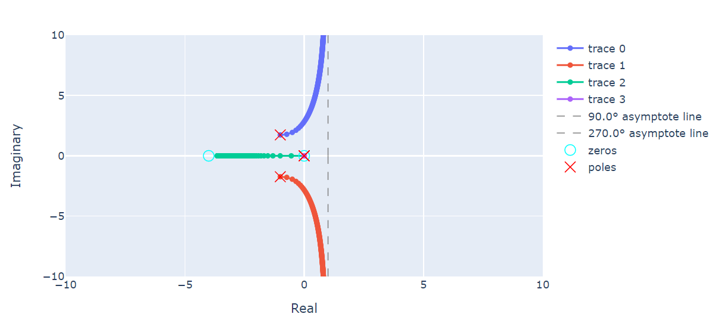
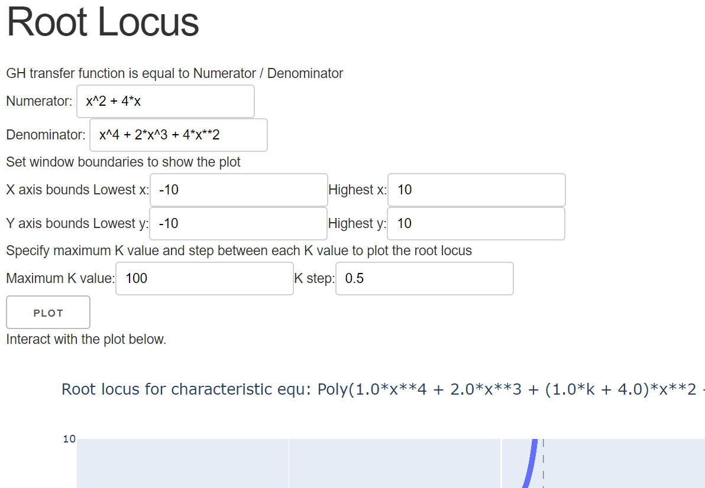

# -rootlocus
  This is a Dash application to plot interactive root locus for a given open loop transfer function. 
  Some code from (https://github.com/kevinzakka/root-locus) was reused.
  
## How to use
  Numerator and denominator of the transfer function can be parsed directly from string representation of polinomial expression with `parse_polynomial(expression)` function.
  This function converts string representations to 1D numpy array of polynomial coefficients which can be directy provided to `transfer_function(numerator, denominator)`. 
  Then `root_locus()` function plots the root locus and returns `plotly` figure. Example:
  ```python
    num = parse_polynomial('(x^2 + 2)*(x)')
    denom = parse_polynomial('x**3 - 2 + 3*x')
    
    GH = transfer_function(num, denom)

    # create a list of evenly spaced gains
    gains = np.linspace(0.0, 100.0, num=1000)
    
    fig = root_locus(GH, gains)
    fig.write_html('tmp.html', auto_open=True)
```
    
## App
  App requires user to input some initial boundaries for axes but after plotting, the plot can be browsed without the boundaries. 
  Maximum gain value and the spacing between gain values can also be specified. [App](https://rootlocus.herokuapp.com/)
  
## Considerations
1. for some expressions plotted traces can get mixed up into each other, although, roots are still correct. try for `num = [1, 4, 0]; denom = [1, 2, 0, 4, 0]`.
2. currently, I can't find any easy, robust method for converting `sympy` polynomial ito a pretty string.